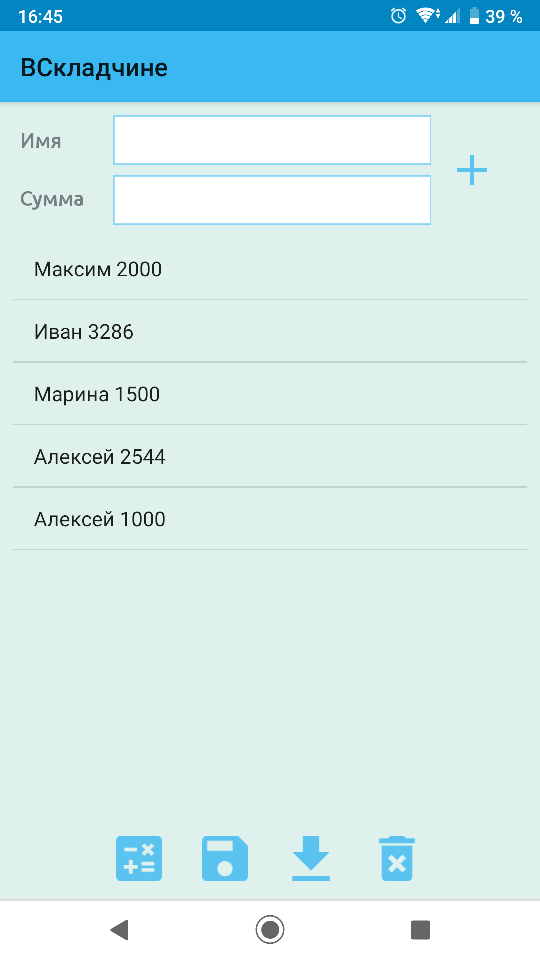
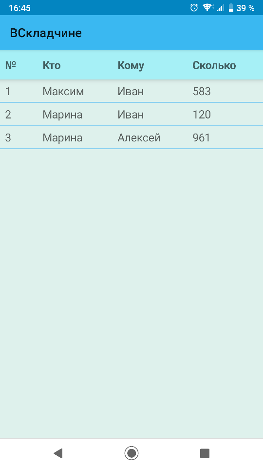
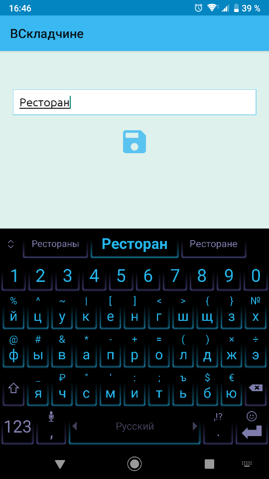

## Кто кому сколько должен

Приложение для Android, позволяющее определить кто сколько и кому должен денег в рамках одного события, 
чтобы каждый его участник имел одинаковый вклад в него

## Ссылка на видео с примером работы приложения

https://cloud.mail.ru/public/BKeB/QUbi4LT2h
